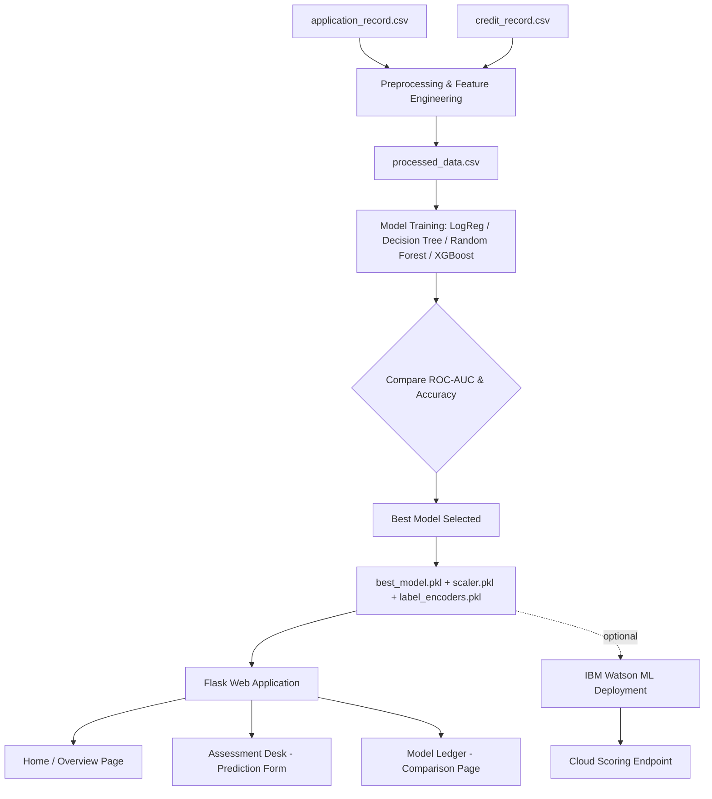
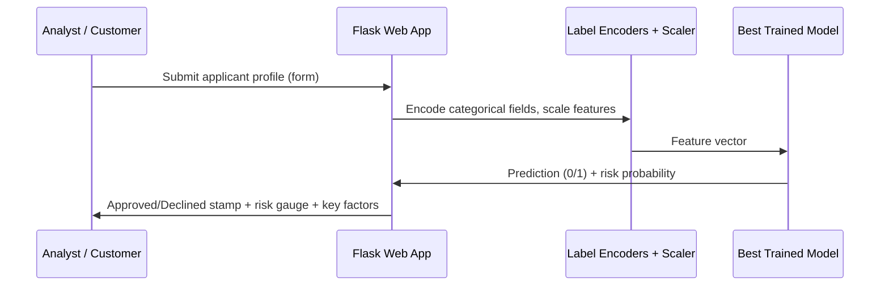

# 3. Project Design Phase

## System Architecture

## Data Flow

## Module Design

| Module | Responsibility |
|---|---|
| `data/generate_data.py` | Produces schema-accurate applicant + credit history data |
| `data/preprocess.py` | Cleans data, engineers features, encodes categories, builds binary target |
| `data/eda.py` | Generates exploratory visualizations |
| `model/train_models.py` | Trains & evaluates 4 classifiers, persists best model |
| `notebook/*.ipynb` | Interactive, narrated version of the EDA → training pipeline |
| `app.py` | Flask routes: home, prediction form, model comparison |
| `templates/*.html` | UI views (Jinja2) |
| `static/css/style.css` | Visual design system |
| `watson_deployment/deploy_to_watson.py` | Optional cloud deployment to IBM Watson ML |

## Feature Schema (Model Input)

| Feature | Type | Notes |
|---|---|---|
| CODE_GENDER_ENC | categorical (encoded) | Male / Female |
| FLAG_OWN_CAR_ENC | categorical (encoded) | Y / N |
| FLAG_OWN_REALTY_ENC | categorical (encoded) | Y / N |
| CNT_CHILDREN | numeric | count |
| AMT_INCOME_TOTAL | numeric | annual income |
| NAME_INCOME_TYPE_ENC | categorical (encoded) | Working / Pensioner / etc. |
| NAME_EDUCATION_TYPE_ENC | categorical (encoded) | education level |
| NAME_FAMILY_STATUS_ENC | categorical (encoded) | marital status |
| NAME_HOUSING_TYPE_ENC | categorical (encoded) | housing type |
| AGE_YEARS | numeric (derived) | from DAYS_BIRTH |
| EMPLOYMENT_YEARS | numeric (derived) | from DAYS_EMPLOYED |
| IS_CURRENTLY_EMPLOYED | binary (derived) | employment status flag |
| FLAG_WORK_PHONE / FLAG_PHONE / FLAG_EMAIL | binary | contact flags |
| OCCUPATION_TYPE_ENC | categorical (encoded) | job category |
| CNT_FAM_MEMBERS | numeric | household size |
| **TARGET** | binary (label) | 0 = Approved, 1 = Rejected |

## UI Design

Three-page Flask app in a "banking ledger" visual theme (navy + aged paper +
gold accents, serif headings):

1. **Overview** — problem statement, key stats, applied scenarios, EDA charts.
2. **Assessment Desk** — data entry form → prediction result page with an
   approval "stamp", a risk-probability gauge, and plain-language decision
   factors.
3. **Model Ledger** — side-by-side comparison table of all 4 trained models,
   with the deployed model highlighted.

## Design Decisions & Rationale

- **ROC-AUC as primary selection metric** (not raw accuracy) — approval data
  is naturally imbalanced, so AUC better reflects real discriminative power.
- **StandardScaler applied uniformly** across all models for a consistent,
  simple deployment pipeline, even though tree-based models don't strictly
  require scaling.
- **LabelEncoders drive both training and the UI dropdowns** — retraining on
  a new dataset automatically keeps the web form's options in sync with what
  the model actually knows.
