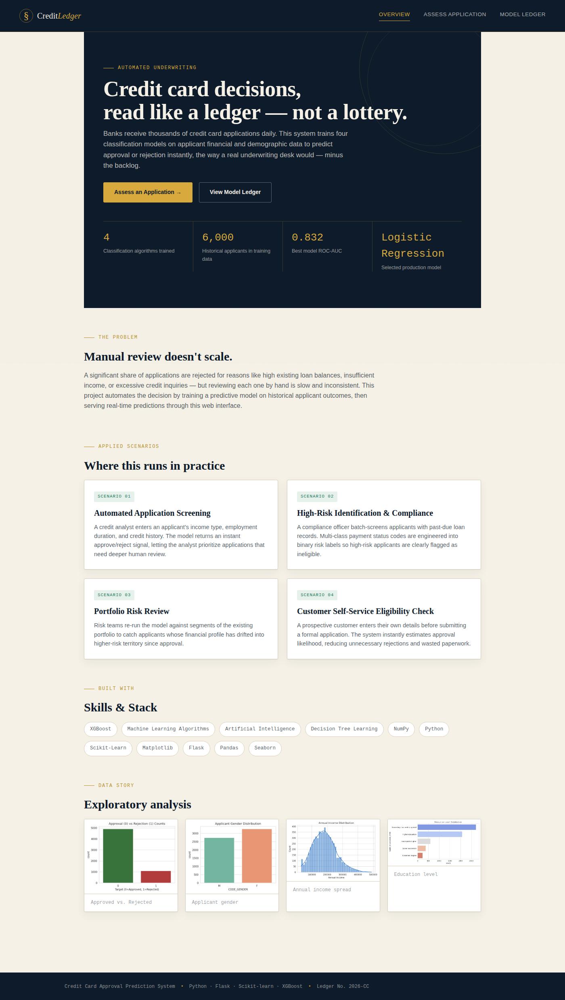
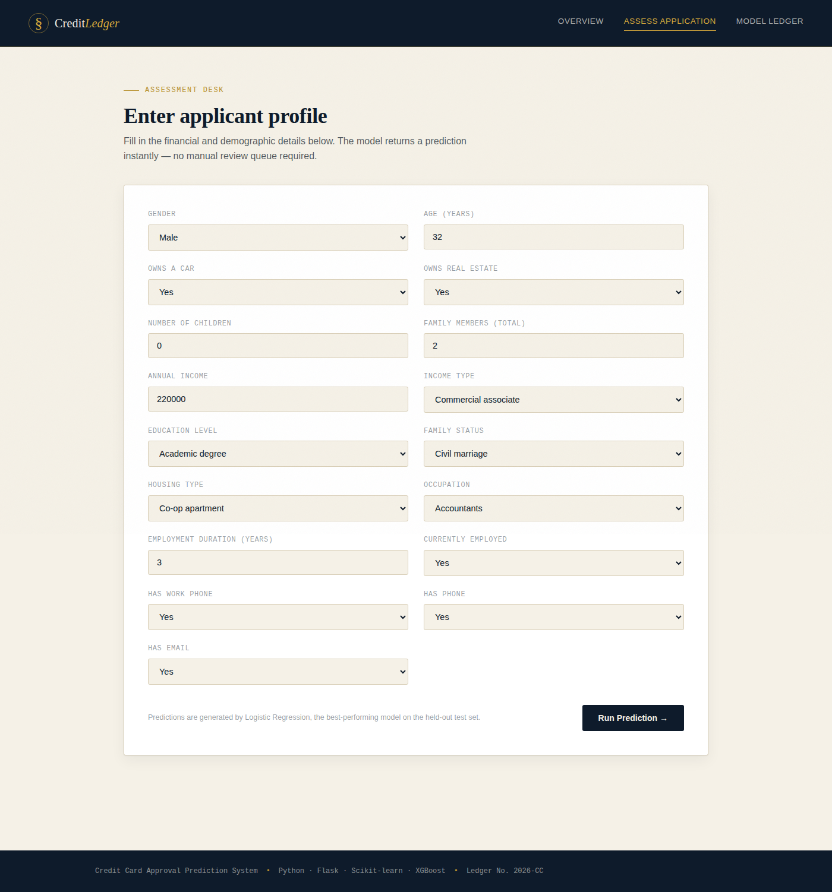
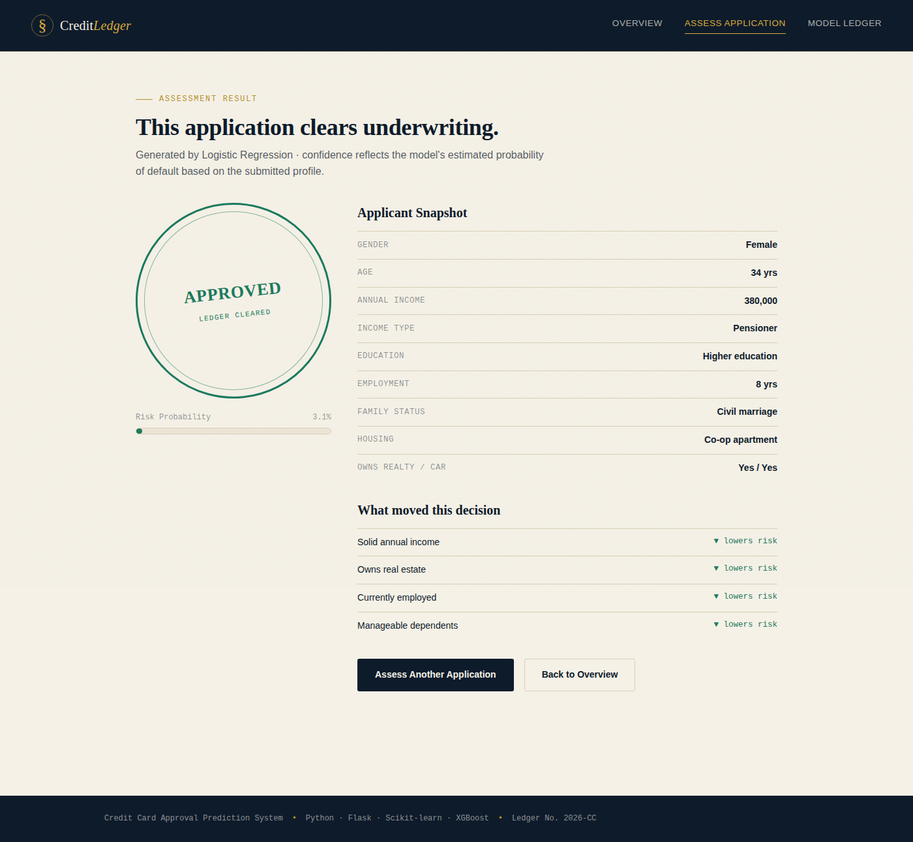
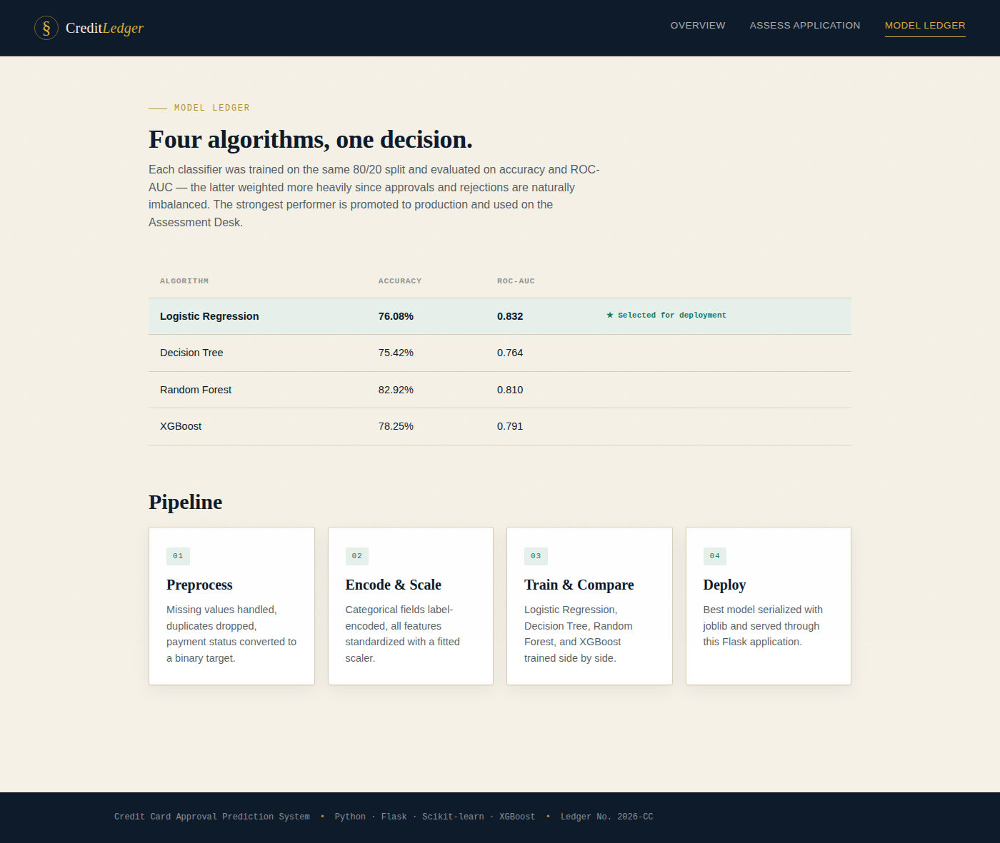

# 8. Project Demonstration

## Live Demo Script

This walkthrough mirrors what a reviewer sees when running the app locally
(`python app.py` from `5. Project Development Phase/`, then visiting
`http://127.0.0.1:5000`).

### Step 1 — Overview Page
The landing page introduces the problem, key project stats (records used,
best model, best ROC-AUC), the four applied scenarios (application
screening, high-risk identification, portfolio review, self-service
eligibility), the tech stack, and the exploratory data analysis charts.

### Step 2 — Assessment Desk (Prediction Form)
A reviewer enters an applicant's profile: gender, age, assets owned,
dependents, income, income type, education, family status, housing type,
occupation, and employment details.

### Step 3 — Prediction Result
Submitting the form returns an instant decision:
- A rotated "stamp" showing **Approved** or **Declined**
- A risk-probability gauge (0–100%)
- An applicant snapshot table
- Plain-language factors that moved the decision (e.g. "Solid annual income
  → lowers risk", "Owns real estate → lowers risk")

Example below: a strong profile (high income, owns car & realty, no
dependents, stable employment) — correctly returns **Approved** with a low
risk score.

### Step 4 — Model Ledger
The comparison page shows all 4 trained algorithms side by side (accuracy,
ROC-AUC), with the deployed model clearly marked as "Selected for
deployment."

## Demo Talking Points

1. **Problem → automation.** Manual review doesn't scale; this system
   returns a decision in under a second.
2. **Model rigor.** Four algorithms were trained and compared honestly —
   the winner was chosen by ROC-AUC (robust to class imbalance), not by
   whichever happened to run first.
3. **Explainability.** Every prediction comes with human-readable factors,
   so an analyst isn't just told "rejected" — they're told *why*.
4. **Reproducibility.** The entire pipeline — from raw data to trained
   model to web app — is scripted and re-runnable (`data/`, `model/`,
   `notebook/`), so retraining on a real dataset is a drop-in swap.
5. **Deployment-ready.** Beyond the local Flask app, `watson_deployment/`
   shows the path to a live IBM Watson ML cloud scoring endpoint.

## Suggested Video/Live Demo Flow (≈3 minutes)

1. (0:00–0:30) Show the Overview page, explain the problem and the 4 scenarios.
2. (0:30–1:30) Fill out the Assessment Desk form live with a realistic
   profile, submit, and narrate the result (stamp, gauge, factors).
3. (1:30–2:00) Submit a second, deliberately weaker profile to show the
   model correctly flips to "Declined."
4. (2:00–2:30) Show the Model Ledger page and explain why Logistic
   Regression (or whichever model wins on a given run) was selected.
5. (2:30–3:00) Briefly show the Jupyter notebook and mention the optional
   IBM Watson ML deployment path for scaling to production.
